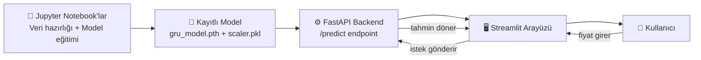

# 📈 Hisse Senedi Fiyatı Tahmini — LSTM & GRU (PyTorch)

Amazon (AMZN) hissesinin geçmiş fiyatlarından gelecekteki fiyatı tahmin eden bir zaman serisi projesi. PyTorch ile sıfırdan yazılmış LSTM ve GRU modelleri eğitilip karşılaştırıldı, ardından model bir API ve web arayüzü ile kullanılabilir hale getirildi.

## 🏗️ Mimari

Proje dört ana katmandan oluşur — model önce notebook'larda eğitilir, sonra bir API üzerinden dışarıya açılır, son olarak bir web arayüzüyle kullanıcıya sunulur:



**Akış nasıl işliyor:**
1. Notebook'larda veri işlenir, LSTM ve GRU modelleri eğitilir ve karşılaştırılır
2. En iyi performansı veren model (GRU) ve ölçekleyici (`scaler`) diske kaydedilir
3. FastAPI backend'i, kaydedilen modeli yükler ve `/predict` adresinden dışarıya bir tahmin servisi sunar
4. Streamlit arayüzü, kullanıcıdan fiyat bilgisi alır, bunu backend'e gönderir ve gelen tahmini ekranda gösterir

## 🛠️ Teknolojiler

| Katman | Teknoloji | Ne işe yarıyor |
|---|---|---|
| Model | PyTorch | LSTM & GRU modellerinin kurulması ve eğitimi |
| Veri işleme | Pandas, NumPy, Scikit-learn | Veri okuma, ölçekleme, sliding window |
| Görselleştirme | Matplotlib | Eğitim/test grafikleri |
| Backend | FastAPI, Uvicorn | Eğitilmiş modeli servis olarak sunan API |
| Frontend | Streamlit | Kullanıcının etkileşime girdiği web arayüzü |
| Ortam | venv, Git/GitHub | İzole geliştirme ortamı ve versiyon kontrolü |

## 📁 Proje Yapısı

```
stock-price-prediction/
├── app.py              → Streamlit arayüzü
├── backend/
│   └── main.py         → FastAPI servisi
├── models/
│   ├── gru_model.pth    → Eğitilmiş model
│   └── scaler.pkl        → Ölçekleyici
├── data/
│   └── amzn_stock.csv   → Ham veri
├── notebooks/
│   ├── week1/  → ML temelleri
│   ├── week2/  → PyTorch temelleri
│   ├── week4/  → Veri hazırlığı
│   └── week5/  → Model eğitimi & karşılaştırma
└── requirements.txt
```

## 📊 Veri Seti

Amazon (AMZN) hissesinin 2006–2018 arası günlük kapanış fiyatları kullanıldı ([Kaggle — DJIA 30 Stock Time Series](https://www.kaggle.com/datasets/szrlee/stock-time-series-20050101-to-20171231)).

## 🧪 Yöntem

- Fiyatlar `MinMaxScaler` ile [-1, 1] aralığına ölçeklendi
- "Sliding window" yöntemiyle geçmiş 30 günlük pencerelerden bir sonraki günü tahmin eden örnekler oluşturuldu
- Veri, zaman sırası korunarak %80 eğitim / %20 test olarak ayrıldı (karıştırma yapılmadı)
- LSTM ve GRU modelleri aynı yapı ile (`hidden_size=32`, `num_layers=2`) 200 epoch eğitildi
- Lookback penceresi (20 → 30 gün) değiştirilerek hiperparametre ayarlaması yapıldı

## 📈 Sonuçlar

| Model | Lookback | Test RMSE |
|-------|----------|-----------|
| LSTM  | 30       | 0.454     |
| GRU   | 30       | **0.089** |

**Öne çıkan bulgu:** GRU, LSTM'e göre belirgin şekilde daha düşük hata elde etti ve daha uzun geçmiş bağlamdan (lookback artışından) çok daha fazla fayda gördü (%52 iyileşme vs %11). Modeller genel trendi takip edebiliyor, ancak hızlı yükseliş dönemlerinde gerçek fiyatın bir miktar altında kalma eğiliminde — zaman serisi tahmininde yaygın görülen bir davranış.

## 🚀 Çalıştırma

**Ortamı kur:**
```bash
git clone https://github.com/gokdenizasik/stock-price-prediction.git
cd stock-price-prediction
python -m venv venv
.\venv\Scripts\Activate.ps1
pip install -r requirements.txt
```

**Backend'i başlat:**
```bash
cd backend
uvicorn main:app --reload
```

**Arayüzü başlat (yeni bir terminalde, kök dizinde):**
```bash
streamlit run app.py
```

## 🔮 Sonraki Adımlar

- LSTM için daha uzun eğitim denemek
- Ek özellikler eklemek (Volume, Open/High/Low)
- Farklı hisse senetleriyle genelleme testi
- Backend'i bulut ortamına deploy etmek

## ⚠️ Not

Bu proje eğitim amaçlıdır, üretilen tahminler gerçek yatırım kararları için kullanılmamalıdır.

## 👤 İletişim

**Gökdeniz Aşık** — [GitHub](https://github.com/gokdenizasik)